# Setup

We will use the following resources:

| Resource         | Link                                                                     |
|------------------|--------------------------------------------------------------------------|
| Resource groups  | https://portal.azure.com/#browse/resourcegroups                          |
| Virtual networks | https://portal.azure.com/#browse/Microsoft.Network%2FvirtualNetworks     |
| Storage accounts | https://portal.azure.com/#browse/Microsoft.Storage%2FStorageAccounts     |
| Azure Cosmos DB  | https://portal.azure.com/#browse/Microsoft.DocumentDb%2FdatabaseAccounts |
| Function App     | https://portal.azure.com/#browse/Microsoft.Web%2Fsites/kind/functionapp  |
| Static Web Apps  | https://portal.azure.com/#browse/Microsoft.Web%2FStaticSites             |

Recommend to open all the links in a new tab since they need time to deploy.
\
While one resources are deploying, you can start moving to the next one. (expect for `Resource groups` and
`Virtual networks`)

Recommend region: `East Asia`

## Resource Group

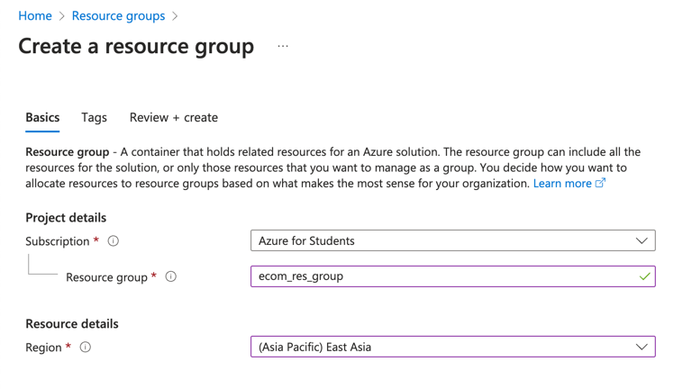

- **Resource group name**: any name you want, in this tutorial will use `ecom_res_group`
- **Region**: `East Asia`

Then sentence `any name you want, in this tutorial will use` will not be shown later on
\
unless specified for other reason.

This also applies on field `Region`.

## Virtual Network

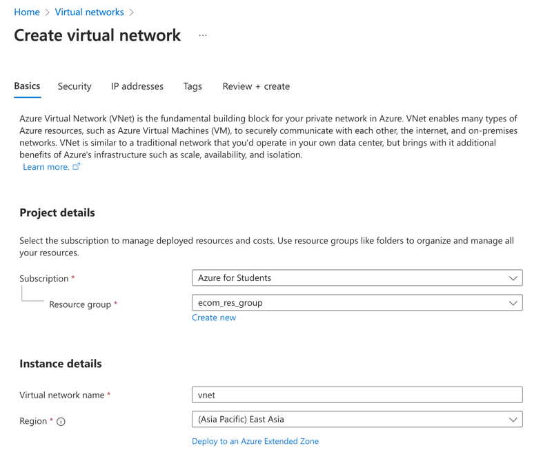
\
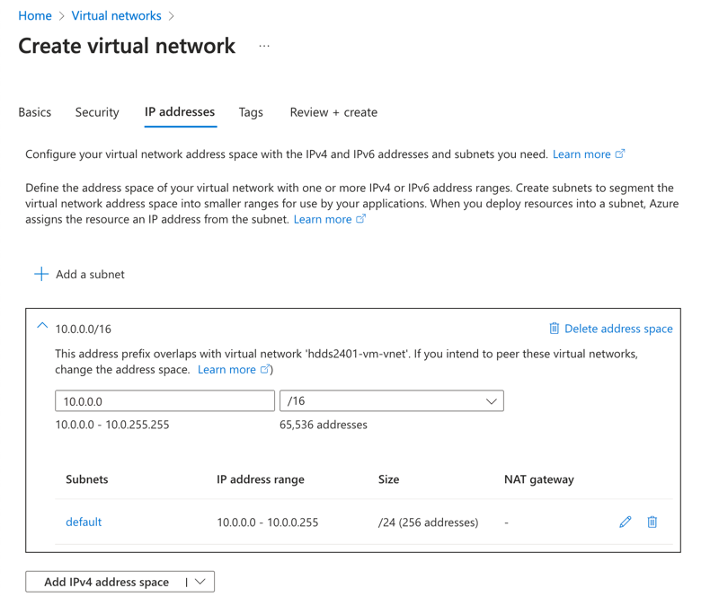

- **Virtual network name**: `vnet`
- Tab **IP Addresses**: using default values

Deploy may need some time, but you can already start deploying the next resource.

## Storage Account

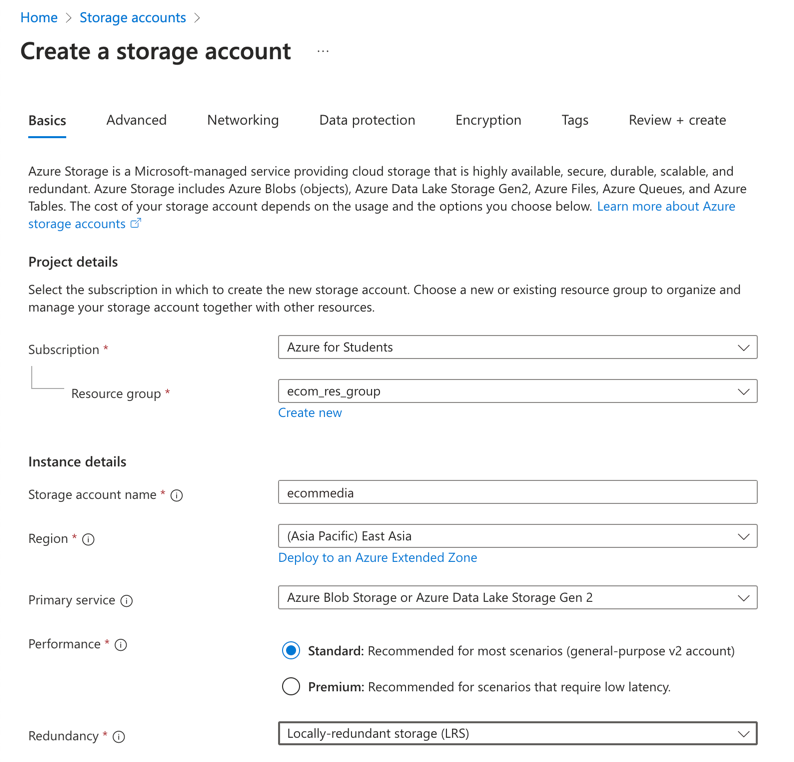

- **Storage account name**: `ecommedia`
- **Redundancy**: `Locally-redundant storage (LRS)`

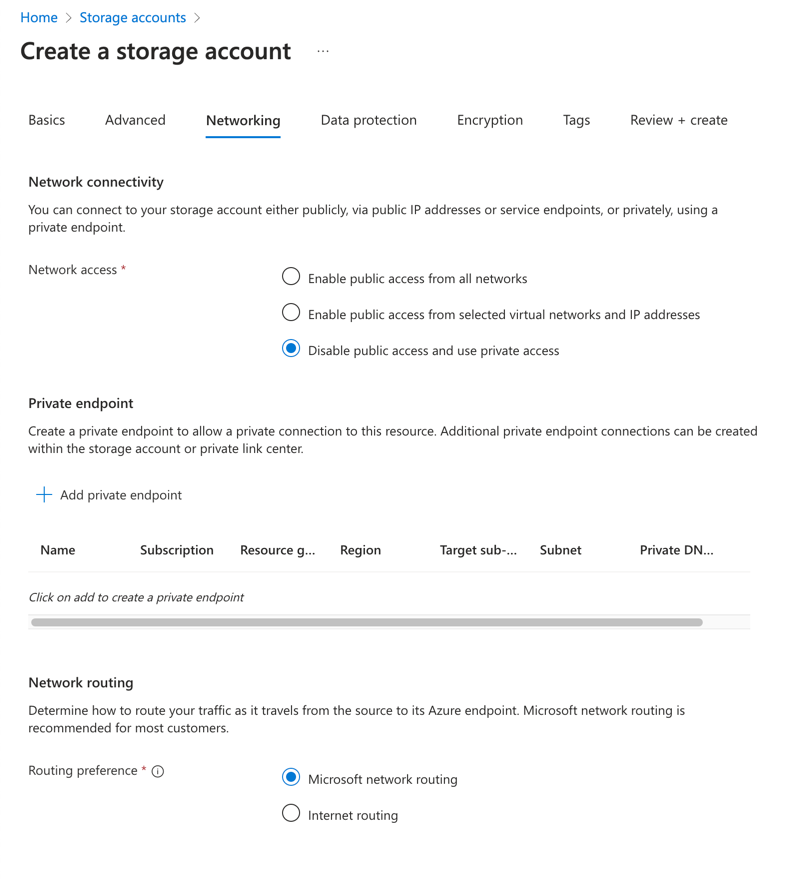

- **Network connectivity**: `Disable network access and use private access`

Click `+ Add private endpoint`

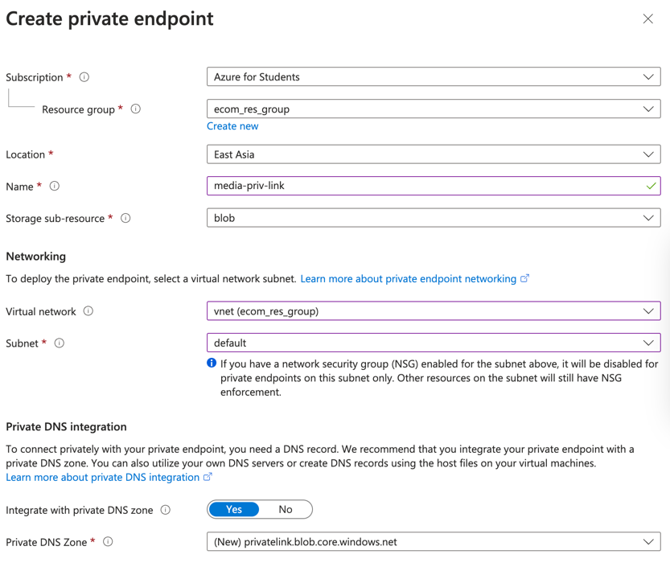

- **Private endpoint name**: `media-priv-link`
- **Virtual network**: `vnet`
    - **Subnet**: `default`

Deploy need a few minutes, please move on.

## Azure Cosmos DB

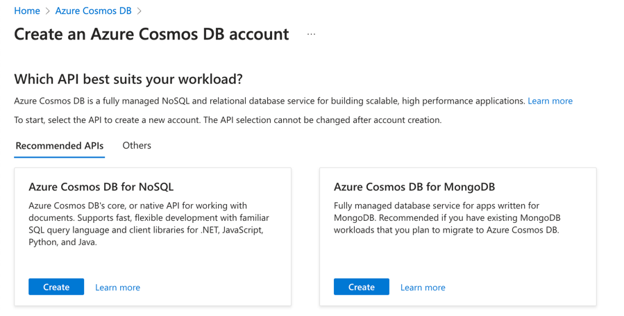

- **Which API best suits your workload?**: `Azure Cosmos DB for MongoDB`

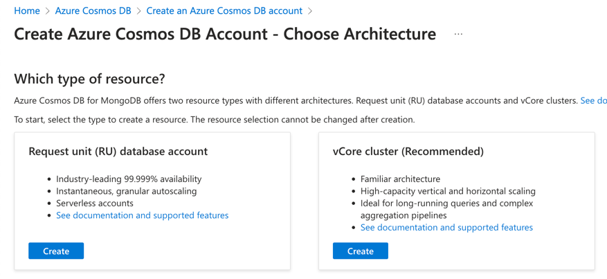

- **Resource**: `Request unit (RU) database account`

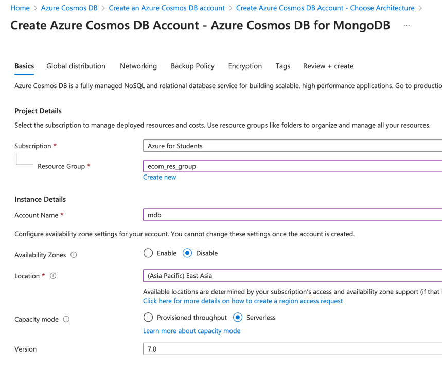

- **Account name**: `mdb`
- **Capacity mode**: `Serverless`

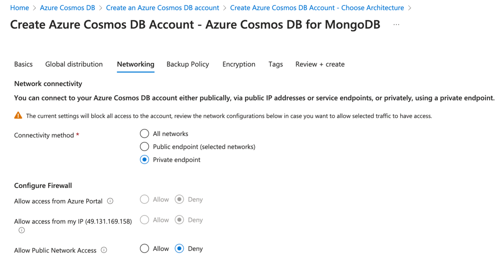

- **Allow Public Network Access**: `Deny`

At `Private endpoint`, Click `+ Add`

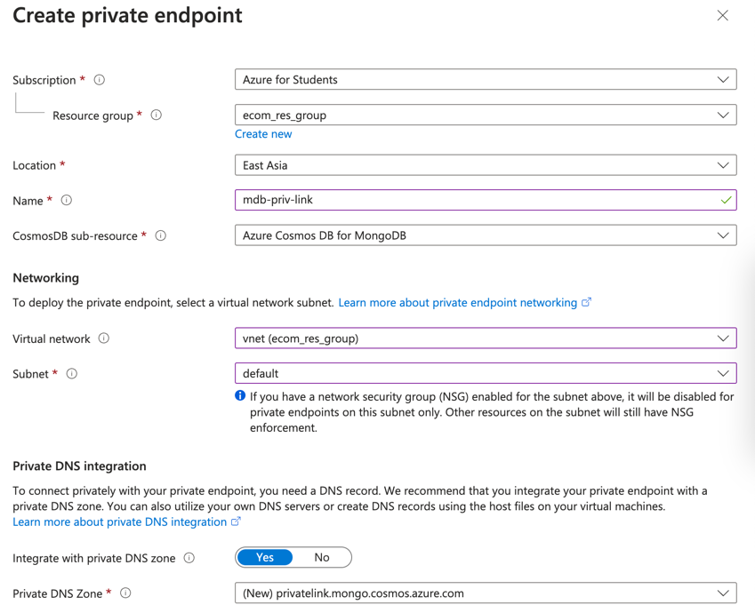

Deploy need a few minutes, please move on.

## Function App

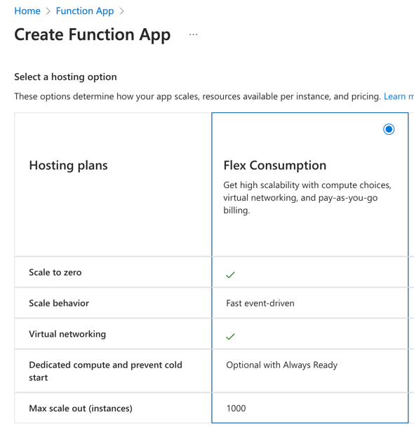

- **Hosting plans**: `Flex Consumption`

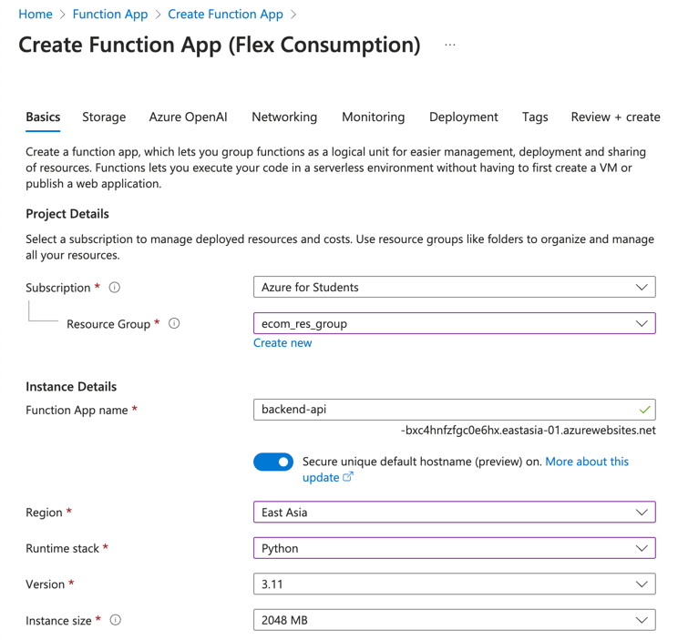

- **Function App name**: `backend-api` (*-XXXXX.eastasia-01.azurewebsites.net*)
- **Secure unique default hostname (preview) on.**: `Yes`
- **Runtime stack**: `Python`
- **Version**: `3.11`
- **Instance size**: `2048 MB`

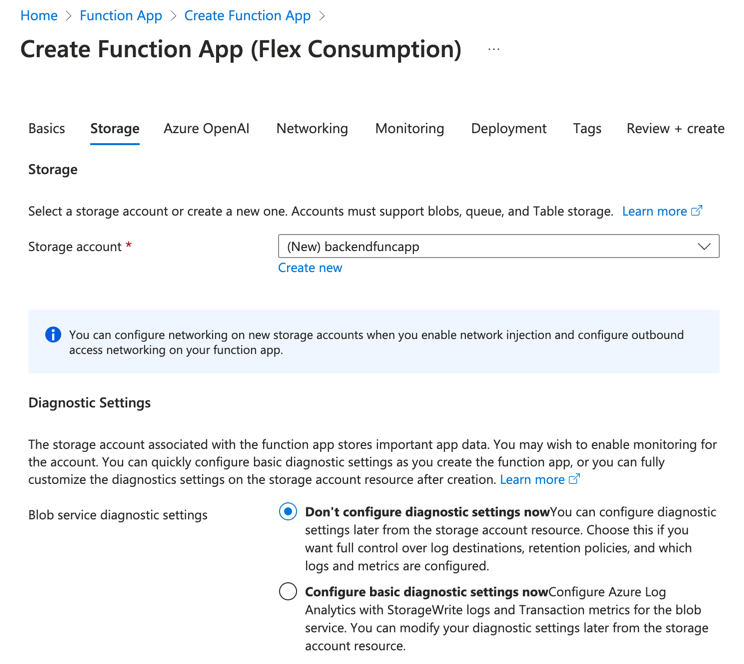

- **Storage account**: `backendfuncapp`

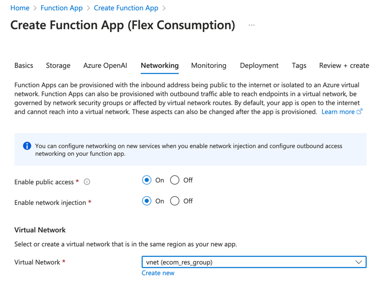

- **Enable network injection**: `Yes`
- **Virtual network**: `vnet`

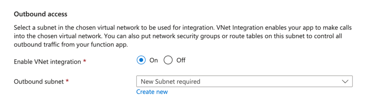

Create a new subnet

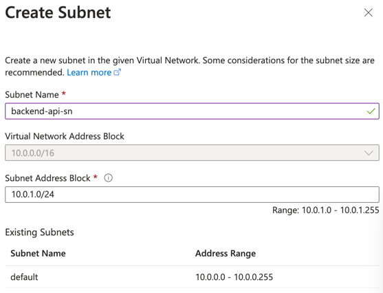

- **Subnet Name**: `backend-api-sn`

Deploy need a few minutes, please move on.

## Static Web Apps

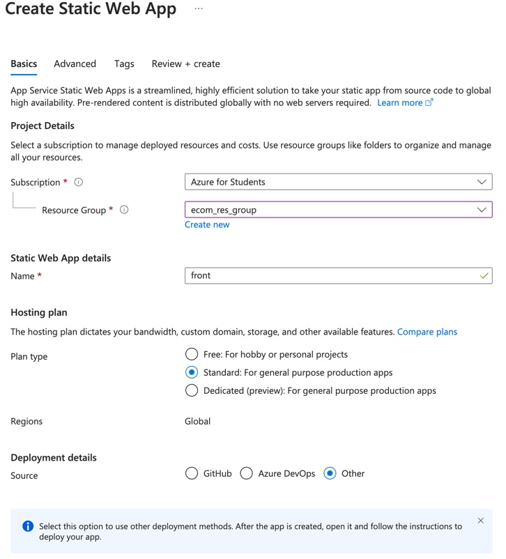

- **Name**: `front`
- **Source**: `Other` (Will will upload via local deployment)

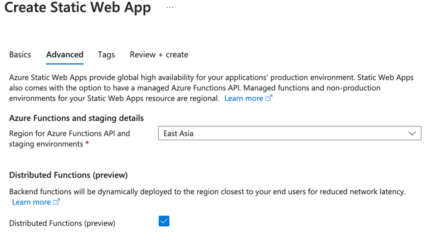

- **Distributed Functions (preview)**: `Yes`

## Summary

Now for all resources that's deploy completed, please click `Go to resource` to go inside the resource.

- **Resource group**: `ecom_res_group`
- **Virtual network**: `vnet`
- **Storage account**: `ecommedia`
- **Azure Cosmos DB**: `mdb`
- **Function App**: `backend-api`
- **Static Web Apps**: `front`

Now you have all the resources deployed (exclude `mdb`), you can start configuring them.

For database, you may need up to 5 minutes (and more) to deploy.

But you can still move on as there's something you can configure.
