# Config resources

In this section, we will link the resources we created in the previous steps.

> **Note**
>
> Free plan is lack of most features, please use standard plan.

## Storage Account

### Obtain connection string

From `ecommedia`, go to `Settings` -> `Access keys`

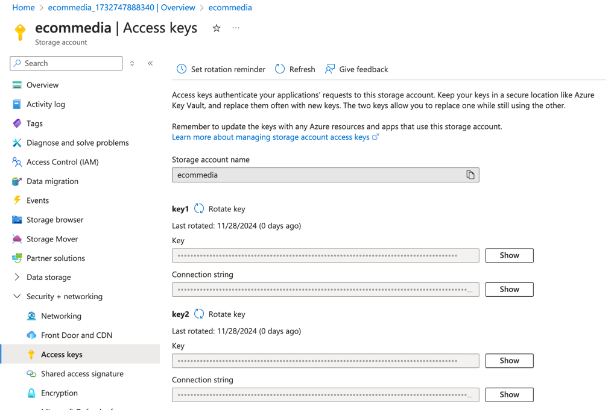

Note down `Connection string` from `key1`, we will use it later.

### Create container

Go to `Data storage` -> `Containers`

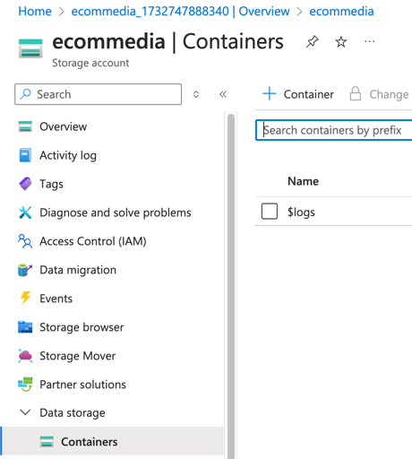

Click `+ Container`

Type `images`

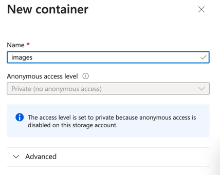

## Frontend

### Obtain deployment token

From `front`, click `Manage deployment token` in tabs.

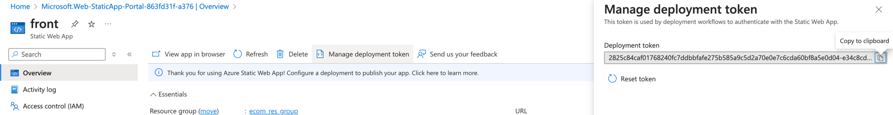

Note down deployment token, we will use it later.

### Linking Backend

From `front`, go to `Settigns` -> `APIs`

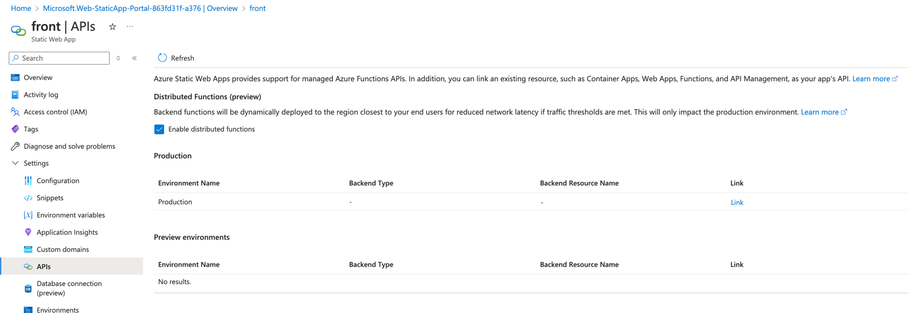

Click `Link` on field `Production`

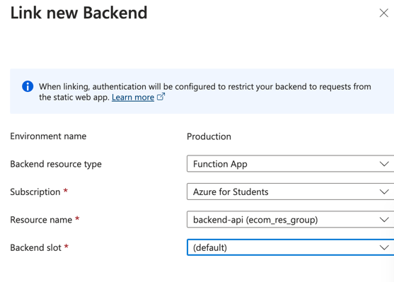

Now you're done linking and backend will only be able to access via frontend's `/api` path.

This ensures that the backend is only accessible via the frontend by `vnet`.

## Database

Wait until the database is deployed.

### Obtain connection string

From `mdb`, go to `Settings` -> `Connection string`

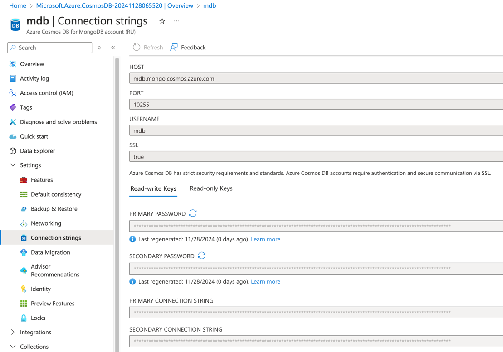

Note down `Primary connection string`, we will use it later.

### Create collection

Go to `Data Explorer` -> `New Collection`

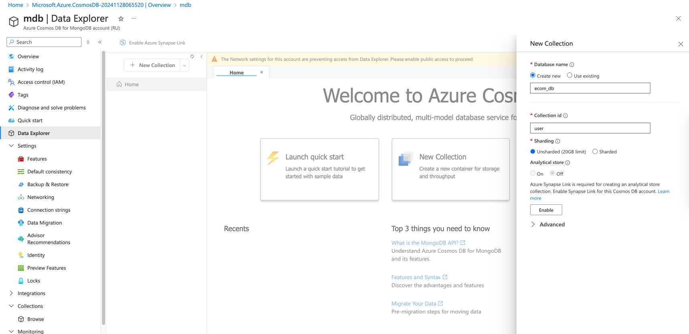

- **Database id**: `ecom_db`
- **Collection id**: `user`
- **Sharding**: `Unsharded (20GB limit)`

### Enable connection for Azure portal middleware

Go to `Networking` (From `Settings`)

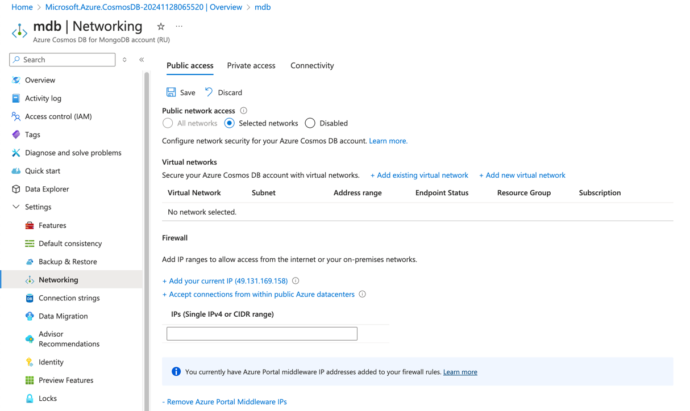

Click `+ Add Azure Portal Middleware IPs`

Then click `Save`

This step ensures you can update your role from Azure portal later.

## Backend (Function App)

From `backend-api`, go to `Settings` -> `Environment variables`

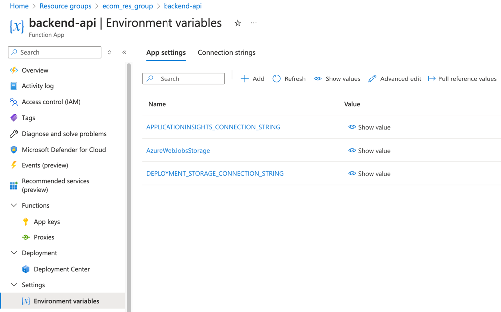

You may see `.env.example.json` from the repository,
\
copy the content and follow the instructions in `.env.example` to fill in the values.

After done, open `Advanced edit` and paste the content.
\
Reminder: Don't overwrite the existing content!

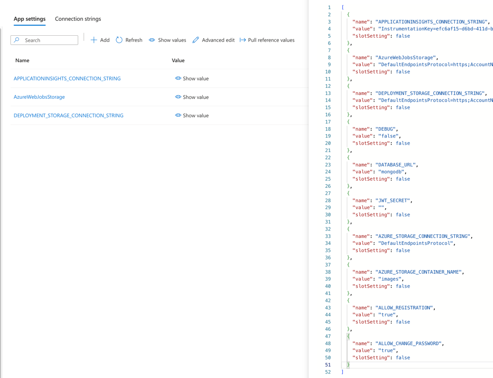

Click `OK`, then `Apply`

And `Confirm`.
