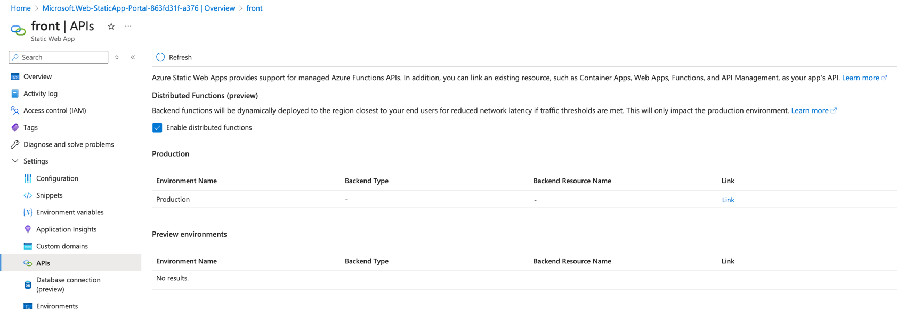

# Azure Azure Cosmos DB (MongoDB)

Page: https://portal.azure.com/#browse/Microsoft.DocumentDb%2FdatabaseAccounts

## Step 1 - Create Cosmos DB

Select `Azure Cosmos DB for MongoDB`

Click `Request unit (RU) database account`

Go `Review + create`, click `Create`

## Step 2 - Copy Connection String

Note down `Primary Connection String`. We'll use it later.

## Step 3 - Create Database and Collection

Go to `Data Explorer`, click `+ New Collection`

Follow the following configuration (must match with the table below):

| Field         | Value     |
|---------------|-----------|
| Database name | `ecom_db` |
| Collection id | `user`    |

Click `OK`

# Recap

- Note down `Primary Connection String`
