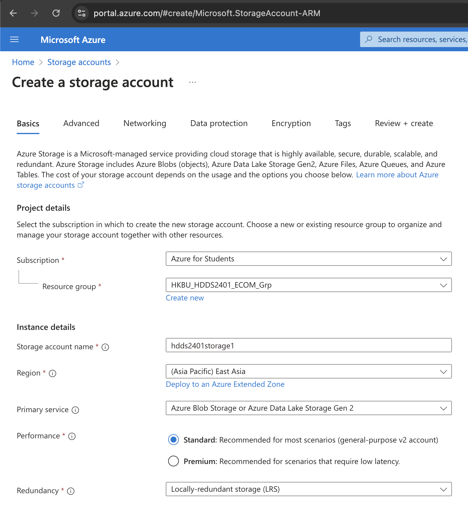

# Azure Blob Storage

Page: https://portal.azure.com/#create/Microsoft.StorageAccount-ARM

## Step 1 - Create a Storage Account

Go `Review + create`, click `Create`

## Step 2 - Copy Connection String

Follow quickstart from [Microsoft Docs](https://learn.microsoft.com/en-us/azure/storage/blobs/storage-quickstart-blobs-portal)

Obtain your `Connection String`. Follow [this doc](https://learn.microsoft.com/en-us/azure/storage/blobs/storage-quickstart-blobs-python?tabs=connection-string%2Croles-azure-portal%2Csign-in-azure-cli&pivots=blob-storage-quickstart-scratch#authenticate-to-azure-and-authorize-access-to-blob-data), Choose `Connection String` Tab.

# Recap

- Note down `Container Name` and `Connection String`
