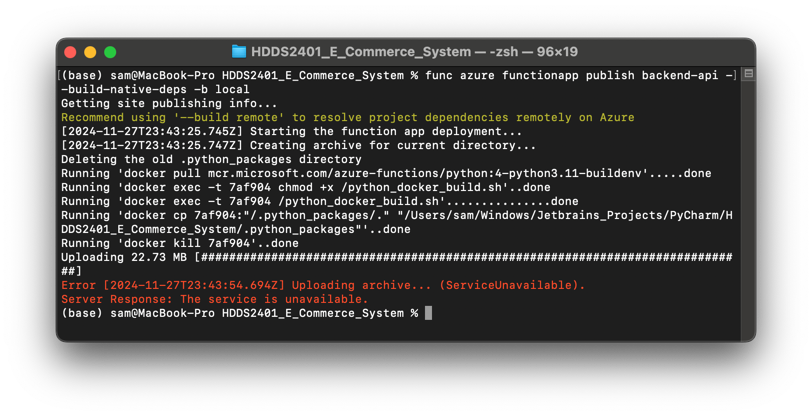

# Deploy codes to Azure

## Frontend

### Pre-requisites

1. Install [Azure CLI](https://learn.microsoft.com/en-us/cli/azure/install-azure-cli), do `az login` and `az upgrade` to
   ensure you have the latest version.

2. Install [Bun.JS](https://bun.js). An engine that's faster and better than `Deno` and `Node.js`.

3. Your `deployment token` from [Obtain deployment token](1_Configure.md#obtain-deployment-token).

### Instructions

Open the terminal and navigate to the frontend directory.

Then, build and deploy the frontend to Azure.

```bash
bun run build
bunx swa deploy dist --deployment-token <token> --env production

# If you have set the environment variable
bun swa:deploy
```

`bun run build`


\


`bunx swa deploy dist --deployment-token <token> --env production`


## Backend

### Pre-requisites

1. Install [Azure CLI](https://learn.microsoft.com/en-us/cli/azure/install-azure-cli), do `az login` and `az upgrade` to
   ensure you have the latest version.

2. Install [Azure CLI](https://learn.microsoft.com/en-us/cli/azure/install-azure-cli), do `az login` and `az upgrade` to
   ensure you have the latest version.

3. (Optional) Install Docker Desktop for later use.

> If you want to deploy via remote build, you can skip this step.

| OS      | Link                                                           |
|---------|----------------------------------------------------------------|
| Windows | https://docs.docker.com/desktop/setup/install/windows-install/ |
| MacOS   | https://docs.docker.com/desktop/setup/install/mac-install/     |
| Linux   | https://docs.docker.com/desktop/setup/install/linux/           |

### Instructions

Open the terminal and navigate to the backend directory.

Then, build and deploy the backend to Azure.

> **Note**
> 
> It's normal to see `FunctionHostSyncTrigger, statusCode = Unauthorized` error.
> \
> This is because the function app already linked to frontend and not accepting direct requests.

```bash
# Remote
func azure functionapp publish backend-api

# Local (Make sure Docker Desktop is installed)
func azure functionapp publish backend-api --build-native-deps -b local
```

#### Remote


#### Local

> **Note**
> 
> If you deploy the first time and see `ServiceUnavailable` error. Please try again.
> 


# Testing

## Frontend

Enter the frontend URL in the browser.


## Backend

Enter the frontend URL + `/api/docs` to access API documentation.


