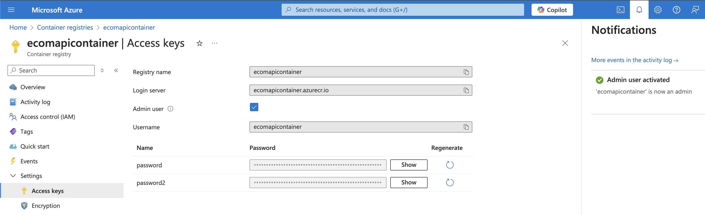
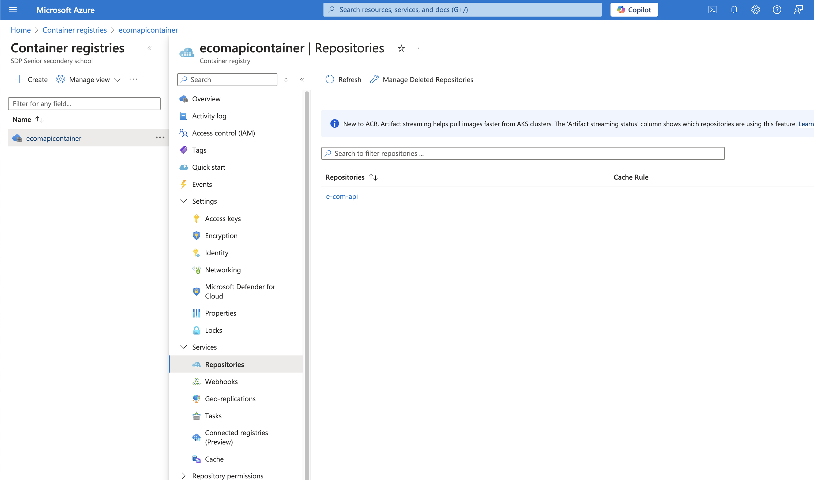
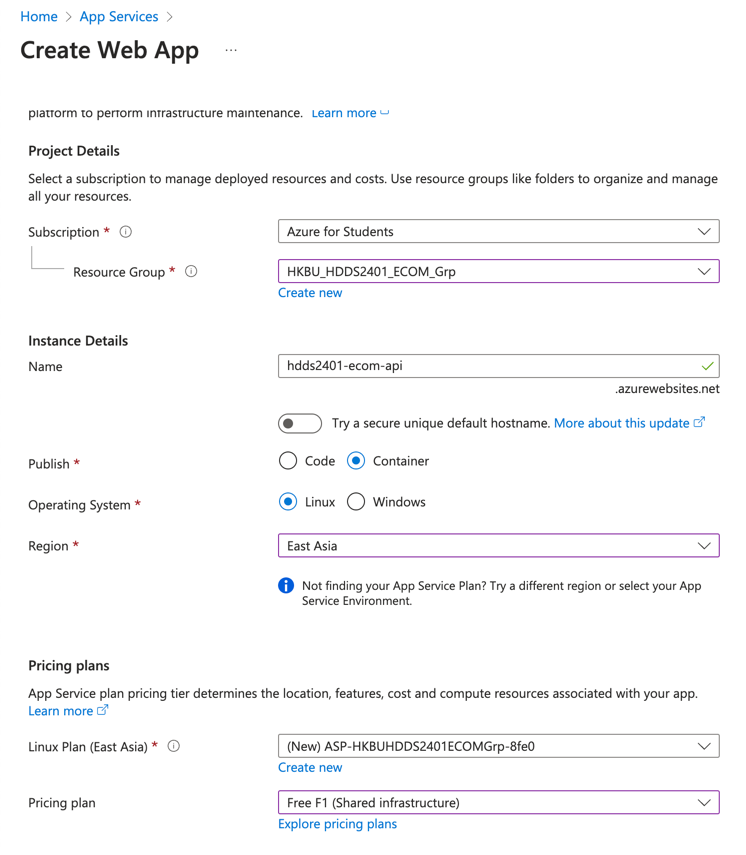
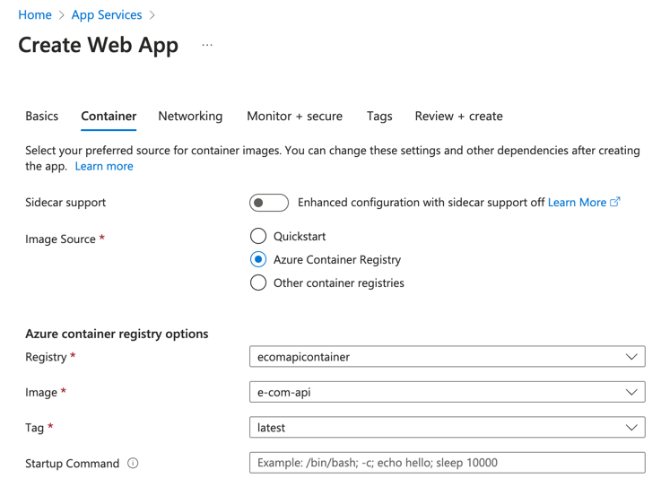
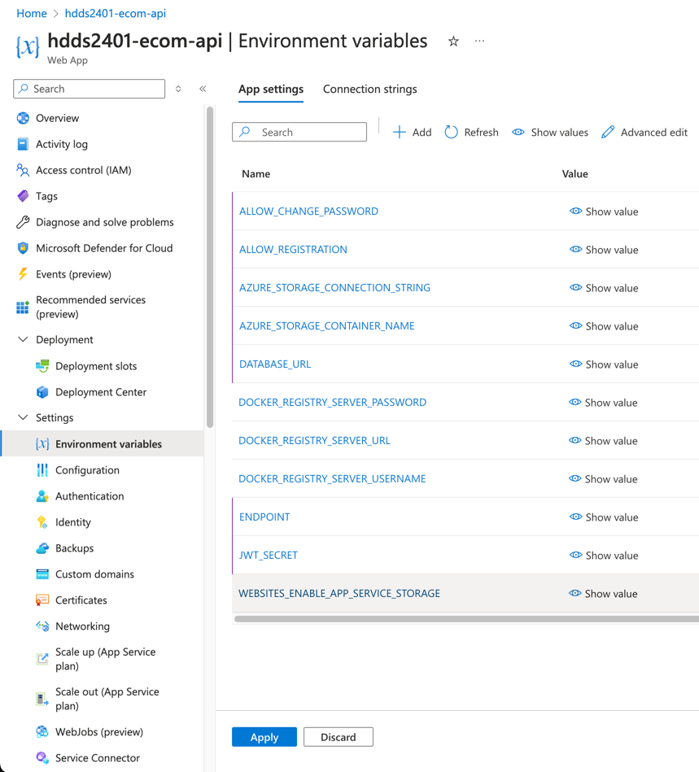
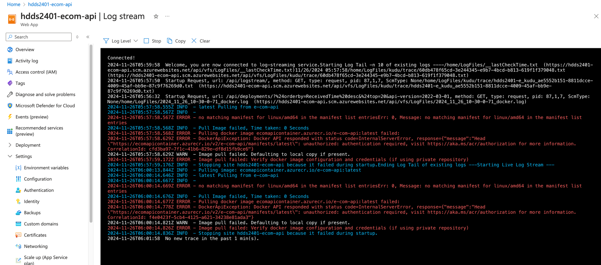
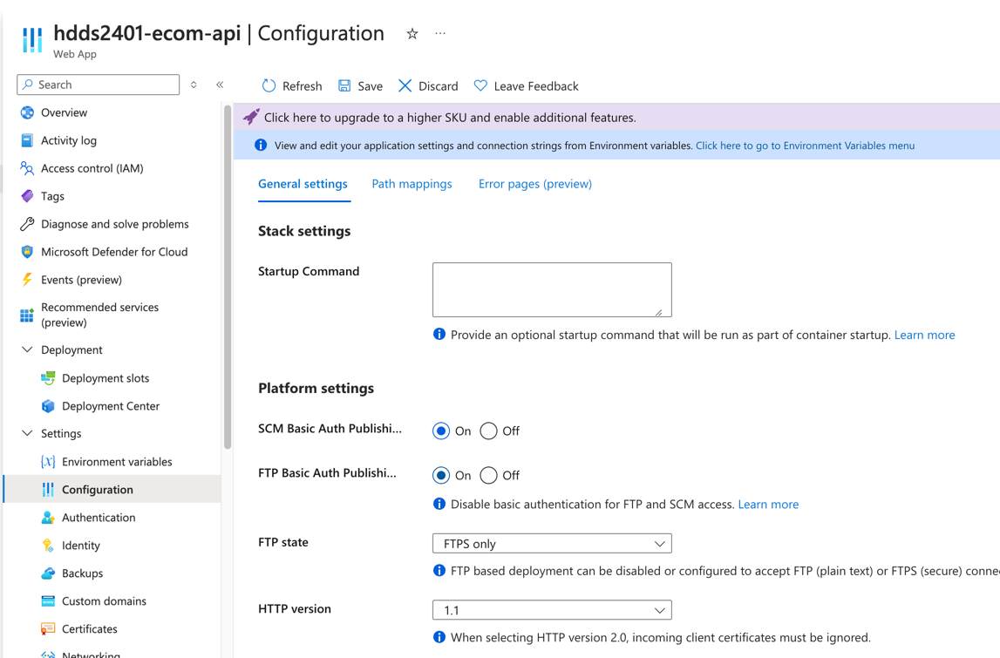

# Deploy API Backend via Registry & App Services

# Pre-requisites

1. Install [Azure CLI](https://learn.microsoft.com/en-us/cli/azure/install-azure-cli), do `az login` and `az upgrade` to
   ensure you have the latest version.

2. Install Docker Desktop for later use.

| OS      | Link                                                           |
|---------|----------------------------------------------------------------|
| Windows | https://docs.docker.com/desktop/setup/install/windows-install/ |
| MacOS   | https://docs.docker.com/desktop/setup/install/mac-install/     |
| Linux   | https://docs.docker.com/desktop/setup/install/linux/           |

3. Take out your noted values.

| Values                      | Source                                  |
|-----------------------------|-----------------------------------------|
| `Primary Connection String` | [Create Database](1_Create_Database.md) |
| `Container Name`            | [Create Blob](2_Create_Blob.md)         |
| `Connection String`         | [Create Blob](2_Create_Blob.md)         |

# Placeholder names

Please replace the following placeholders with your own values, we'll use them in the following steps as a reference.

Resource Group: `HKBU_HDDS2401_ECOM_Grp`
\
Registry: `ecomapicontainer`
\
Image name: `e-com-api`

> **Note**: This value is generated by Azure, you can find how to get it in the following steps.

ACR Name: `ecomapicontainer`

4. Clone the repository

```bash
git clone https://github.com/01101sam/HDDS2401_E_Commerce_System.git e-commerce-system
cd e-commerce-system
```

## Step 1 - Create a resource group and Azure Container Registry

Open your terminal and run the following commands:

```bash
az group create --name HKBU_HDDS2401_ECOM_Grp --location eastasia

az acr create --resource-group HKBU_HDDS2401_ECOM_Grp --name ecomapicontainer --sku Basic
```

## Step 2 - Build the image in Azure Container Registry

> Since `ACR is temporarily suspending ACR task runs funded by Azure free credits.` (stated
>
at [Microsoft Community Q&A](https://learn.microsoft.com/en-us/answers/questions/1684863/acr-tasks-requests-for-the-registry-are-not-permit))
>
> We need another way to upload the image to Azure registry
> \
> And we actually found one [solution](https://stackoverflow.com/a/77985811)!

Page: https://portal.azure.com/#browse/Microsoft.ContainerRegistry%2Fregistries

Now, let's go to our [container registry](https://portal.azure.com/#browse/Microsoft.ContainerRegistry%2Fregistries) and
select the registry you just created.

Go to `Settings` -> `Access Keys`, turn on `Admin user`.



Once done, login to your ACR account.

```bash
az acr login --name ecomapicontainer
```

Wait a bit and should show `Login Succeeded`

> **Warning**: `linux/amd64` is important, as App Service only supports this platform.
> \
> If you tries to not specify the platform, you'll end up with this error:
>
>
`no matching manifest for linux/amd64 in the manifest list entriesErr: 0, Message: no matching manifest for linux/amd64 in the manifest list entries`

```bash
docker build --platform linux/amd64 --tag e-com-api .
docker tag e-com-api ecomapicontainer.azurecr.io/e-com-api
docker push ecomapicontainer.azurecr.io/e-com-api
```

Now we see our image has been pushed to Azure Container Registry.



### Step 3 - Create an App Service

Page: https://portal.azure.com/#view/HubsExtension/BrowseResource/resourceType/Microsoft.Web%2Fsites

We can
follow [Create the web app](https://learn.microsoft.com/en-us/azure/developer/python/tutorial-containerize-deploy-python-web-app-azure-04?tabs=azure-portal#1-create-the-web-app)
guide to create an App Service.

Switch `Azure portal` tab and follow the instructions, but region has to be `East Asia`.



Note down `Hostname`, we will use it as `ENDPOINT` later.



Go `Review + create` and `Create`.

#### Step 4 - Update Environment variables

Go to our app at `App Service` -> `Settings` -> `Environment variables` and add the following variables:

| Environment Key                   | Value                                       |
|-----------------------------------|---------------------------------------------|
| `MONGODB_URL`                     | `Primary Connection String`                 |
| `AZURE_STORAGE_CONNECTION_STRING` | `Connection String`                         |
| `AZURE_STORAGE_CONTAINER_NAME`    | `Container Name`                            |
| -                                 | -                                           |
| `JWT_SECRET`                      | openssl rand -hex 32                        |
| `ENDPOINT`                        | https://hdds2401-ecom-api.azurewebsites.net |
| -                                 | -                                           |
| `ALLOW_REGISTRATION`              | `true`                                      |
| `ALLOW_CHANGE_PASSWORD`           | `true`                                      |

Remember to replace your endpoint with the one you just created.



Click `Apply` -> `Confirm` to save the changes.

### Step 5 - Configure ACR Permissions

#### Oh what happened?!



Don't worry, we didn't give the permission to the App Service to access the ACR, so image pull failed.

Follow this
guide: [Configure managed identity and webhook](https://learn.microsoft.com/en-us/azure/developer/python/tutorial-containerize-deploy-python-web-app-azure-04?tabs=azure-portal#2-configure-managed-identity-and-webhook)

> Friendly reminder: Don't forget to check your `SCM Basic Auth` and `FTP Basic Auth` has to be enabled!
>
> Path: `Settings` -> `Configuration`


