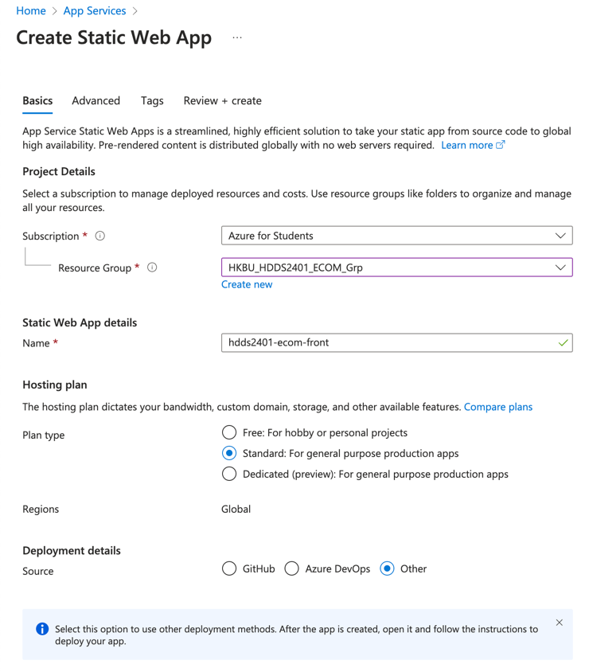
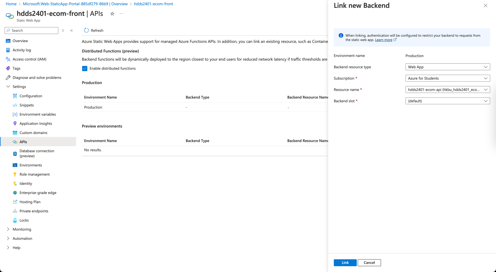
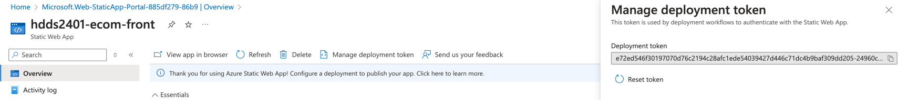
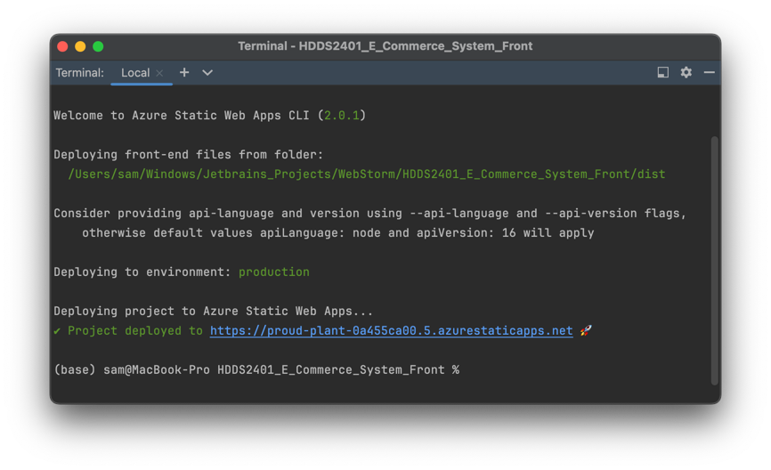
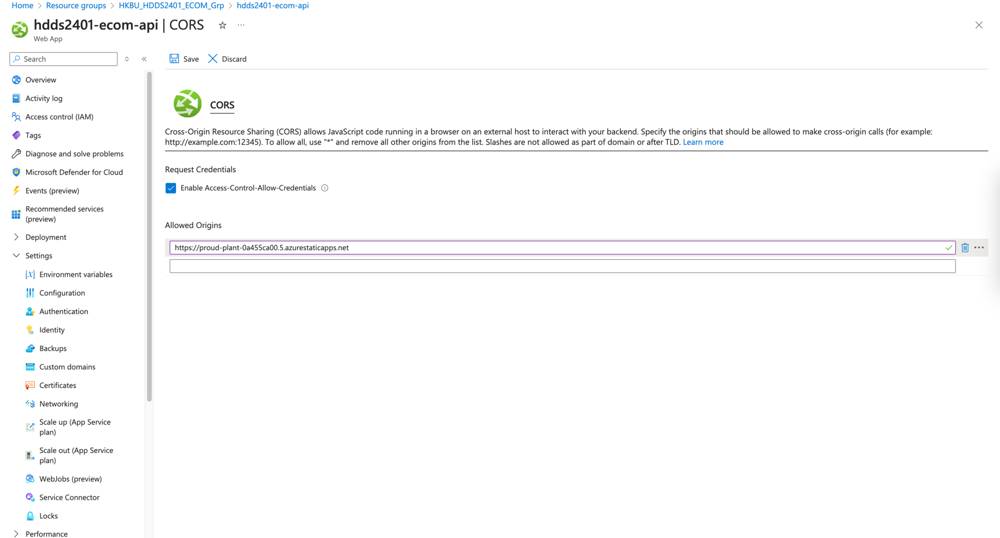

# Deploy Frontend via App Service

# Pre-requisites

1. Install [Azure CLI](https://learn.microsoft.com/en-us/cli/azure/install-azure-cli), do `az login` and `az upgrade` to
   ensure you have the latest version.

2. Install [Bun.JS](https://bun.js). An engine that's faster and better than `Deno` and `Node.js`.

3. Take out your noted values.

| Values      | Source                                        |
|-------------|-----------------------------------------------|
| `ENDPOIONT` | [Deploy API Backend](3_Deploy_API_Backend.md) |

4. Clone the repository

```bash
git clone https://github.com/01101sam/HDDS2401_E_Commerce_System_Front.git e-commerce-system-front
cd e-commerce-system-front

# Install dependencies
bun install
```

## Step 1 - Create App Service

Page: https://portal.azure.com/?websitesextension_ext=asd.featurePath%3Danalysis%2FLinuxAppDown#create/Microsoft.StaticApp



Click `Review + create` and then `Create`.

## Step 2 - Configure App Service

Go to the App Service you just created.

#### Link to the API Backend

Go to `Settings` -> `APIs`



#### Deployment token

> **WARNING**
>
> Don't store the deployment token in a public repository. It should be kept secret!

You can get a deployment token either from:

- The [Azure portal](https://portal.azure.com/): **Home → Static Web App → Your Instance → Overview → Manage deployment
  token**

- If you are using the Azure CLI, you can get the deployment token of your project using the following command:

```bash
az staticwebapp secrets list --name <application-name> --query "properties.apiKey"
```



You can then use that value with the `--deployment-token <token>` (e.g. from a CI/CD environment),
\
or you can create an environment variable called `SWA_CLI_DEPLOYMENT_TOKEN` and set it to the deployment token. Read the
next section for more details.

## Step 3 - Deploy

```bash
bun build
swa deploy dist --deployment-token <token> --env production

# If you have set the environment variable
bun swa:deploy
```



## Step 4 - Configure Backend CORS

Go to the API Backend you created in [step 3](3_Deploy_API_Backend.md).

Then, go to `API` -> `CORS`.

Check `Enable Access-Control-Allow-Credentials`

Enter the frontend URL in the `Allowed origins` field.



Click `Save`.
