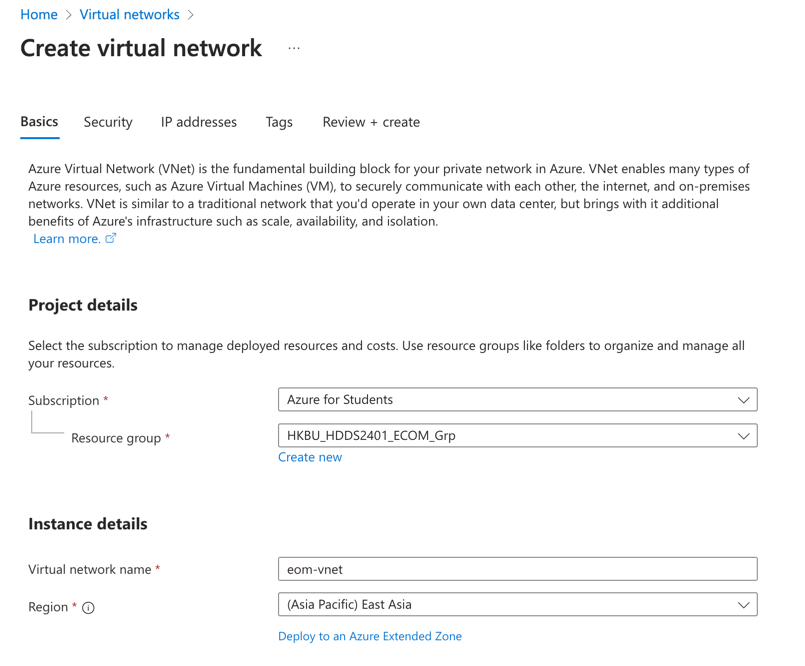
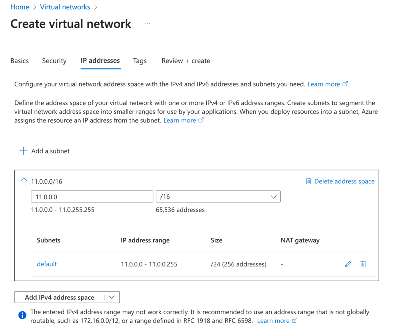
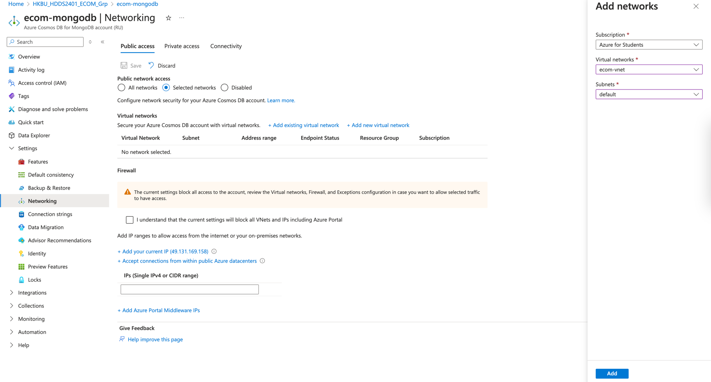
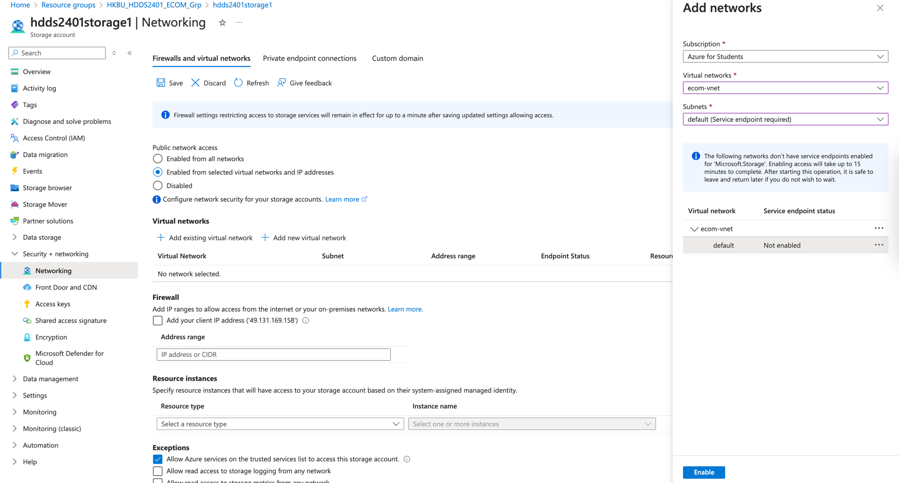
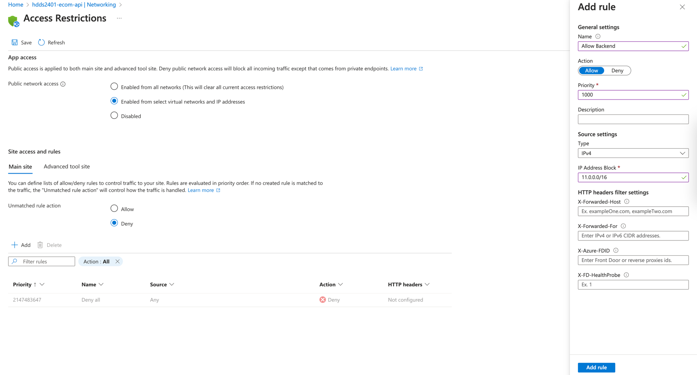

# Configure Azure Virtual Network

> **Note**
> 
> Before starting this step, you should have completed the previous steps.
> \
> Which you can now try testing is everything working fine.

Page: https://portal.azure.com/#create/Microsoft.VirtualNetwork-ARM

Default settings is enough for this scale of architecture.
\
Just click "Review + create" and then "Create".

> **Note**: If you already had a Virtual Network created, you should assign a CIDR that isn't overlapping with the one you already have.
> 
> 

#### Step 1 - Link All Resources to the Virtual Network

#### Database

> **Note**
> 
> If you need to access database on your local machine, you can click `+ Add your current IP` and save.

Go to the database you created in [step 1](1_Create_Database.md).

Then, `Settings` -> `Networking` -> `Public access` -> `+ Add existing virtual network`.

Database Status should be `Updating` for a while.
\
While we are waiting, let's continue.

#### Blob Storage

Go to the storage account you created in [step 2](2_Create_Blob_Storage.md).

Then, `Settings` -> `Networking` -> `+ Add existing virtual network`.

After `Add`, click `Save`.

#### App Service (Backend API)

Go to the App Service you created in [step 3](3_Deploy_API_Backend.md).

Then, `Settings` -> `Networking`.

In `Inbound traffic configuration`, you should see `Public network access` is `Enabled with no access restrictions` by default.

Follow the configuration which `IP Address Block` is the CIDR of the Virtual Network you created.

